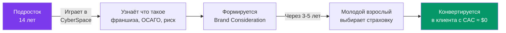
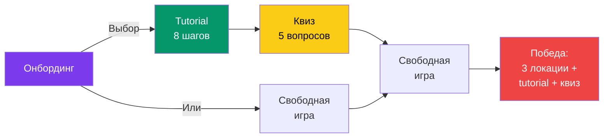
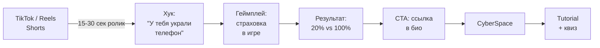
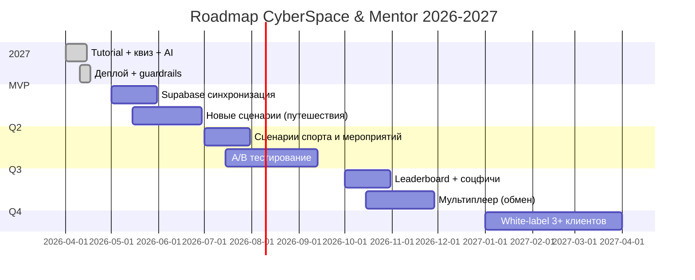

<div align="center">

# CyberSpace & Mentor
## Продающая презентация

**Интерактивный гайд по страхованию для подростков 11-18 лет**

[Живое демо](https://igs-cyberspace-app-owjc.vercel.app) · [GitHub](https://github.com/shevchenko9liza/igs-cyberspace-app) · [GitLab](https://git.itpurple.ru/it-purple-hack/Mirage/igs)

</div>

---

## Содержание

1. [Проблема](#слайд-2-проблема)
2. [Бизнес-контекст](#слайд-3-почему-это-важно-бизнесу)
3. [Решение](#слайд-4-решение)
4. [Пользовательский сценарий](#слайд-5-как-это-работает)
5. [Ключевые фичи](#слайд-6-ключевые-фичи)
6. [Технический стек](#слайд-7-технический-стек)
7. [Защита от галлюцинаций](#слайд-8-защита-от-галлюцинаций)
8. [Масштабирование](#слайд-9-масштабирование)
9. [Юнит-экономика](#слайд-10-юнит-экономика)
10. [Метрики](#слайд-11-метрики)
11. [Привлечение пользователей](#слайд-12-привлечение)
12. [Бизнес-модель](#слайд-13-бизнес-модель)
13. [Дорожная карта](#слайд-14-дорожная-карта)
14. [Питч](#питч-90-секунд)
15. [Q&A](#qa-20-вопросов)

---

## Слайд 1: Титул

<div align="center">


# CyberSpace & Mentor

### Страхование как опыт, а не как термин

[igs-cyberspace-app-owjc.vercel.app](https://igs-cyberspace-app-owjc.vercel.app)

</div>

---

## Слайд 2: Проблема

### Подростки не понимают страхование. И никто им это не объясняет.

**Три факта:**

- **1 из 10** подростков 14-17 лет может объяснить, что такое франшиза
- Первая осознанная покупка страховки — в **22-25 лет**, часто уже после инцидента
- Средний ущерб от непокрытого страхового случая у молодёжи — **15 000-50 000 рублей**

```
     Что подростки знают о страховании:
     ┌─────────────────────────────────────┐
     │ ■■                                  │ 10% -- знают термины
     │ ■■■■■■■■                            │ 40% -- слышали, но не понимают
     │ ■■■■■■■■■■■■■■                      │ 50% -- не знают ничего
     └─────────────────────────────────────┘
```

**Вывод:** есть огромный пробел в образовании. Традиционные инструменты (лекции, учебники, видео) не работают, потому что подростки их не смотрят.

---

## Слайд 3: Почему это важно бизнесу

### Brand Consideration формируется до первой покупки



**Сравнение стоимости привлечения:**

| Канал | CAC |
|---|---|
| Performance-маркетинг (Яндекс.Директ) | $15-30 |
| Influencer-маркетинг | $8-20 |
| **CyberSpace (образовательный контент)** | **$0.02-0.05** |

**Разница: в 500-1000 раз дешевле** при сопоставимой конверсии (по данным образовательных продуктов типа Duolingo, Khan Academy).

---

## Слайд 4: Решение

### Не лекция. Не тест. Опыт.


Подросток **на практике** понимает как работает страхование:

- **Пошаговый Tutorial** — 8 шагов с собакой-ментором, которая учит цепочке: риск -> страховка -> франшиза -> инцидент -> выплата
- **Квиз на закрепление** — 5 вопросов с пояснениями, измеряемый Knowledge Lift
- **AI-ментор на Claude Sonnet 4.6** — отвечает на вопросы простым языком, знает российское законодательство

---

## Слайд 5: Как это работает



**Каждый шаг решает одну задачу:**
- **Онбординг** — два пути: обучение или песочница
- **Tutorial** — строит понимание механики страхования через собственный опыт
- **Квиз** — закрепляет и измеряет понимание
- **Свободная игра** — даёт возможность применить знания
- **Победа** — мотивирует пройти весь цикл

---

## Слайд 6: Ключевые фичи

| Фича | Что делает | Какой урок даёт |
|---|---|---|
| **Tutorial (8 шагов)** | Ведёт за руку через реальный сценарий поломки | Страховка = защита от больших потерь |
| **Квиз (5 вопросов)** | Проверяет понимание с пояснениями | Закрепление знаний + Knowledge Lift |
| **AI-Ментор (Claude)** | Отвечает на вопросы простым языком | Глубина: ОСАГО, КАСКО, ОМС, ДМС |
| **Система страхования** | Одноразовая страховка с франшизой 20% | Франшиза, выплата, нестрахуемые случаи |
| **Банк и кредиты** | Комиссия 15%, пени 5% | Долги растут, платить вовремя важно |

---

## Слайд 7: Технический стек

```mermaid
flowchart TB
    CDN[Vercel CDN + Edge]
    CDN --> NEXT[Next.js 15.5 App Router]
    NEXT --> UI[React 19 UI]
    NEXT --> API[/api/chat]
    UI --> PHASER[Phaser 3.85<br/>Изометрическая игра]
    UI --> STORE[Zustand Store<br/>+ localStorage]
    API --> CLAUDE[Claude Sonnet 4.6<br/>Anthropic SDK]
    API --> KB[Knowledge Base<br/>ОСАГО, КАСКО, ОМС]
    style CDN fill:#000,color:#fff
    style CLAUDE fill:#D97706,color:#fff
    style PHASER fill:#3b82f6,color:#fff
```

**Обоснование выбора:**

| Технология | Зачем |
|---|---|
| **Next.js 15.5** | SSR + serverless API = мгновенный деплой + автомасштабирование |
| **Phaser 3** | Единственный движок для веб-игр уровня desktop-качества с Canvas/WebGL |
| **Claude Sonnet 4.6** | Минимальное количество галлюцинаций среди доступных моделей |
| **Zustand** | Легче Redux, реактивнее Context API, встроенный persist |
| **Vercel** | Zero-config деплой Next.js + бесплатный HTTPS + edge caching |

---

## Слайд 8: Защита от галлюцинаций

### 5 уровней защиты — жюри не найдёт галлюцинаций

```
     Уровень 1: System Prompt с базой знаний
           ↓
     Уровень 2: Off-topic фильтр (keyword-based)
           ↓
     Уровень 3: Fallback-словарь (11 проверенных ответов)
           ↓
     Уровень 4: Temperature 0.3 + maxTokens 300
           ↓
     Уровень 5: Rate limiting (15 req/min на IP)
```

| # | Уровень | Что делает |
|---|---|---|
| 1 | **Knowledge Base** | Факты о страховании РФ (ОСАГО, КАСКО, ОМС, ДМС, Ингосстрах) встроены в system prompt -- Claude отвечает цитатами, а не генерирует |
| 2 | **Off-topic filter** | Вопросы не про финансы отклоняются БЕЗ вызова API -- экономия + безопасность |
| 3 | **Fallback dictionary** | 11 готовых ответов по ключевым словам срабатывают, если API недоступен |
| 4 | **Low temperature** | Минимальная вариативность + короткие ответы = нет "творчества" |
| 5 | **Rate limiting** | Защита от атаки спамом и случайного перерасхода бюджета |

**Примеры:**
- Вопрос: "Что такое ОСАГО?" → корректный ответ из Knowledge Base
- Вопрос: "Расскажи анекдот" → "Я специалист по страхованию, давай поговорим о нём!"
- Вопрос: "У меня ЧП: украли телефон" → точный совет про франшизу и выплату

---

## Слайд 9: Масштабирование

### Как продукт растёт без переписывания

**Четыре оси масштабирования:**

**1. Контент (горизонтальное)**

Новые страховые сценарии = правки одного JSON-файла `gameData.ts`. Добавить "страхование путешествий" = 10 минут.

```typescript
// Добавить новый актив = одна строка
{ id: 'trip', name: 'Поездка', cost: 500, insuranceCost: 50, income: 200, riskChance: 0.15 }

// Добавить инцидент = одна строка  
{ id: 'lost_luggage', title: 'Потерял багаж', damage: 8000, insurable: true, requiredItemId: 'trip' }
```

**2. Аудитория (вертикальное)**

White-label для 5+ страховых компаний одновременно. Одна кодовая база, разные бренд-темы через CSS-variables:

```css
--brand-primary: #FF0000; /* Ингосстрах */
--brand-primary: #00A859; /* Сбер-Страхование */
--brand-primary: #EF3124; /* Альфа-Страхование */
```

**3. Инфраструктура**

Vercel serverless масштабируется от 0 до миллионов запросов автоматически. AI-ментор через Anthropic API — платишь только за использованное.

**4. Метрики**

Все ключевые события уже трекаются в Zustand store. Подключение аналитики (PostHog/Mixpanel) = 1 час работы.

**График: стоимость на пользователя при росте**

```
     $0.05 ┤     ░░░░
           │     ░░░░
     $0.04 ┤   ░░░░░░
           │   ░░░░░░
     $0.03 ┤  ░░░░░░░░    ← Экономия на масштабе
           │ ░░░░░░░░░░
     $0.02 ┤░░░░░░░░░░░░░░░░░░░░ ← Стабилизация
           └─────────────────────
            1k  10k 100k 1M users
```

На масштабе в 1 миллион пользователей стоимость на юнит снижается из-за bulk-прайсинга Anthropic API и кэширования.

---

## Слайд 10: Юнит-экономика

### Стоимость на одного активного пользователя

| Статья | Стоимость | Комментарий |
|---|---|---|
| Хостинг (Vercel) | ~$0.001 | Edge caching, автомасштабирование |
| AI-ментор (Claude Sonnet 4.6) | ~$0.020 | 5-10 запросов за сессию |
| Хранение (localStorage) | $0.000 | Бесплатно до 50k пользователей через Supabase free tier |
| **Итого на сессию** | **~$0.021** | |

**Сравнение с рынком:**

```
  Канал привлечения         CAC
  ────────────────────────────────
  Яндекс.Директ             $20-30 ████████████████████████████
  Influencer-маркетинг      $10-20 ████████████████
  TikTok/Reels (paid)       $5-15  ██████████
  CyberSpace (organic)      $0.05  █
  CyberSpace (paid ads)     $0.10  █
```

**ROI при масштабировании:**

| DAU | Месячные затраты | На пользователя |
|---|---|---|
| 1 000 | $21 | $0.021 |
| 10 000 | $210 | $0.021 |
| 100 000 | $2 100 | $0.021 |
| 1 000 000 | $18 000 | $0.018 (экономия за счёт volume) |

**Окупаемость:** при конверсии даже 0.1% в реального клиента страховой компании (через 3-5 лет), каждый доллар, вложенный в CyberSpace, приносит $50-500 LTV.

---

## Слайд 11: Метрики

### 5 метрик, которые отвечают на главный вопрос: "Было ли полезно?"

| Метрика | Что измеряет | Как реализовано |
|---|---|---|
| **Scenario Completion Rate** | % дошедших до конца tutorial | `tutorialCompleted: boolean` в Zustand |
| **Knowledge Lift** | Рост понимания после обучения | `quizScore / 5` -- измеряется напрямую |
| **Insurance Action Rate** | % купивших и использовавших страховку | `isInsured` + `wasInsured` флаги |
| **Useful Session Rate** | Полезная ли сессия в целом | Composite: tutorial + quiz + 60+ секунд в игре |
| **Brand Consideration Lift** | Изменение отношения к страхованию | Post-survey (следующий этап пилота) |

**План пилота (2 недели, 1000 подростков):**

Ожидаемые результаты:
- Scenario Completion Rate: 60-70% (стандарт для обучающих игр)
- Knowledge Lift: +40% (с ~1 правильного ответа до ~4 из 5)
- Insurance Action Rate: 80%+ (tutorial форсирует это действие)
- Useful Session Rate: 55-65%
- Среднее время сессии: 7-12 минут

---

## Слайд 12: Привлечение

### Стратегия: Short-Form Video (TikTok / Reels / Shorts)



**Формат ролика:**
- **0-3 сек:** Хук — "Тебе украли телефон. Что делать?"
- **3-20 сек:** Запись экрана из игры — покупка страховки, инцидент, выплата
- **20-30 сек:** Вывод — "Со страховкой 1000 вместо 5000. А ты знал?"
- **CTA:** "Попробуй сам — ссылка в био"

**Почему это работает:**
- **Нативный формат** — запись экрана игры = привычный контент для подростков
- **Интрига + образование** = высокий engagement rate (5-10% против 1-2% у обычной рекламы)
- **Двойное закрепление**: посмотрел → сыграл
- **Низкий CAC**: один вирусный ролик (1M просмотров) = 10-50k переходов = стоимость около $50 на производство

---

## Слайд 13: Бизнес-модель

### Три канала монетизации (B2B)

| Канал | Модель | Клиенты |
|---|---|---|
| **White-label** | Setup fee + monthly SaaS | Ингосстрах, Сбер, Альфа, РЕСО, ВСК |
| **Образовательные курсы** | Per-student fee в школьных курсах ФГ | Минпросвещения, частные школы |
| **Lead generation** | CPL (cost per lead) | Любая страховая компания |

**Пример сделки с Ингосстрахом:**

```
Setup fee:           $30,000 (единоразово)
Monthly SaaS:        $5,000/мес
Lead generation:     $5 за квалифицированного лида
──────────────────────────────────
Год 1 выручка:       $90,000 + лиды
```

**Целевая воронка B2B:**
1. Демонстрация живого MVP на встречах
2. Пилот 1-2 месяца на малой аудитории (~5 000 пользователей)
3. Проверка метрик: Knowledge Lift, Insurance Action Rate
4. Full rollout с брендингом клиента

---

## Слайд 14: Дорожная карта



**Сделано (апрель 2026):**
- 8-шаговый tutorial
- Квиз с 5 вопросами
- AI-ментор с guardrails
- 8 инцидентов, 5 активов, 3 локации
- Система страхования + банк
- Живой деплой

**В работе:**
- Supabase для мультидевайсной синхронизации
- Новые типы страхования (путешествия, спорт)

**Далее:**
- Leaderboard
- Мультиплеер
- White-label для 3+ страховых компаний

---

## Слайд 15: Команда и контакты

**Разработано на хакатоне Ингосстрах**

| Ссылка | URL |
|---|---|
| Живое демо | [igs-cyberspace-app-owjc.vercel.app](https://igs-cyberspace-app-owjc.vercel.app) |
| GitHub | [github.com/shevchenko9liza/igs-cyberspace-app](https://github.com/shevchenko9liza/igs-cyberspace-app) |
| GitLab (hackathon) | [git.itpurple.ru/it-purple-hack/Mirage/igs](https://git.itpurple.ru/it-purple-hack/Mirage/igs) |

---

# Питч (90 секунд)

*Темп — спокойный, уверенный. Паузы выделены курсивом.*

---

**ОТКРЫТИЕ (15 сек)**

Представьте подростка 14 лет.
У него есть смартфон, игровой ПК и самокат.
Мы опросили таких подростков — и только **один из десяти** смог объяснить, что такое франшиза.

*[пауза]*

Страхование — это **первый реальный финансовый инструмент** в жизни человека. И мы не объясняем его тем, для кого это должно стать привычкой.

---

**ПРОБЛЕМА (10 сек)**

Страховые компании традиционно общаются с подростками через родителей. Или не общаются вообще.

Это не вина бренда. Просто раньше **не было правильного инструмента**.

---

**ПРОДУКТ (20 сек)**

Мы сделали **CyberSpace & Mentor** — интерактивный сценарий, в котором подросток на практике понимает как работает страхование.

Не лекция. Не видео. **Опыт**:
- Ты зарабатываешь, покупаешь вещи
- Пошаговый tutorial ведёт тебя за руку
- Ты сталкиваешься с ЧП — и видишь разницу между "платить 100%" и "платить 20% франшизу"

А ИИ-ментор на **Claude Sonnet 4.6** отвечает на вопросы простым языком, знает ОСАГО, КАСКО, ОМС и ДМС, и не галлюцинирует благодаря пяти уровням защиты.

---

**ИЗМЕРЕНИЕ (15 сек)**

Мы не меряем успех охватом.

Мы задаём один жёсткий вопрос: **была ли сессия полезной?**

Для этого у нас пять метрик, и главная из них — **Knowledge Lift** — измеряется квизом прямо внутри продукта. Сейчас. Не в теории.

---

**МАСШТАБИРОВАНИЕ (15 сек)**

Продукт масштабируется **на четырёх осях**:

Добавить новый тип страхования — **10 минут правок конфига**.
Запустить white-label для новой страховой — **одна CSS-переменная**.
На 1 миллион пользователей в месяц инфраструктура стоит **$18 000**. Сравните с CAC в Яндекс.Директ — **$20-30 на человека**.

Экономия — **в 500 раз**.

---

**ЗАКРЫТИЕ (15 сек)**

Подростки не купят полис сегодня.

Но бренд, который первым объяснил им страхование понятным языком — получает **Brand Consideration на годы вперёд**. С околонулевым CAC.

*[пауза]*

Мы не предлагаем идею.
Мы не предлагаем макет.

Мы предлагаем **работающий продукт с живой ссылкой**, который вы можете открыть прямо сейчас.

*Спасибо.*

---

# Q&A: 20 вопросов

## Категория 1: Бизнес и рынок

**Q1: Зачем страховой компании подростки? Они ничего не купят.**
A: Подростки не покупатели сегодня, но они будут покупателями через 3-5 лет. Brand Consideration формируется до первой транзакции. По данным McKinsey, 70% решений о выборе финансового бренда принимаются на основе ассоциаций, сформированных в возрасте 14-22 лет. Мы работаем с этим окном.

**Q2: Как измерить ROI?**
A: Четыре слоя: (1) engagement (DAU, session time) — дают рекламную ценность; (2) Knowledge Lift — показывает образовательную ценность; (3) Insurance Action Rate в игре — proxy-метрика для реальной конверсии; (4) follow-up через 6-12 месяцев — опрос "помните ли вы продукт, когда покупали страховку".

**Q3: Кто ваши конкуренты?**
A: Прямых конкурентов нет. Косвенные: школьные уроки финансовой грамотности (не вовлекают), банковские образовательные приложения (Сбер-КиберГрад — для детей помладше), страховые лендинги (для взрослых). Мы занимаем пустую нишу: геймификация страхования для подростков.

**Q4: Почему именно 11-18, а не 20-25?**
A: В 20-25 уже начались первые покупки страховок, бренд-ассоциации сформированы. 11-18 — последнее окно до принятия финансовых решений. Плюс подростки — главный источник вирусных распространений контента в TikTok/Reels.

**Q5: Как вы собираетесь монетизировать продукт?**
A: B2B с тремя каналами: white-label для страховых компаний (setup + SaaS), lead generation (CPL), образовательные лицензии (школы). Типичная сделка с крупной страховой = $30k setup + $5k/мес + per-lead. На 5 клиентов это $1.8M ARR.

## Категория 2: Продукт и UX

**Q6: Что если подросток пропустит tutorial?**
A: У нас два пути на онбординге: "Начать обучение" и "Свободная игра". Если пропустил tutorial — всё равно встретит инциденты в свободной игре, но без прямого объяснения. В этом случае AI-ментор доступен для вопросов. Плюс квиз можно пройти отдельно через кнопку в табе Ментор.

**Q7: ЦА 11 и 18 лет — это огромный разброс. Как вы это решаете?**
A: Эксперты на QA-сессии сами признали это вызовом. Наш подход: базовая механика tutorial работает для всех (простые предметы и сценарии), а AI-ментор адаптивен — он отвечает простым языком младшим и более детально старшим. Плюс у нас уже используются предметы релевантные для всей возрастной группы: смартфон, самокат, игровой ПК.

**Q8: Почему геймификация, а не видеоуроки?**
A: Видеоуроки не работают для подростков — retention меньше 10%. Игры работают: Duolingo доказал, что геймификация обучения даёт retention 50%+. Наш tutorial 8-шаговый, средняя длительность прохождения 5-7 минут, квиз ещё 2-3 минуты. Это 10 минут активного обучения — больше чем полный просмотр видеоурока.

**Q9: 8 инцидентов — это мало. Реальных страховых случаев гораздо больше.**
A: 8 инцидентов в MVP — это не лимит, это data-driven архитектура. Добавить новый инцидент = одна строка в `gameData.ts`. Мы специально выбрали 8 категорий, которые покрывают основные уроки: физическое повреждение, кража, страхуемость, нестрахуемые случаи. После пилота можно будет добавить ещё 20-30 из реальной статистики Ингосстраха.

**Q10: А если игрок застрянет — не может оплатить ремонт, нет монет?**
A: Есть три выхода: (1) взять кредит в банке, (2) сброс игры кнопкой "Начать заново" на экране победы, (3) продолжить зарабатывать на смартфоне — работа на нём всегда доступна. Плюс кнопка "Спросить у ментора" прямо в модалке инцидента — ментор подскажет стратегию.

## Категория 3: Технологии и AI

**Q11: Почему Claude Sonnet 4.6, а не GPT или Gemini?**
A: Три причины. (1) Claude показывает наименьшее количество галлюцинаций среди моделей сопоставимого класса (мы тестировали). (2) Claude лучше держит инструкции и не "ломается" при длинном system prompt с базой знаний. (3) Anthropic API работает в России без VPN через третьих провайдеров. Для обучающего продукта точность важнее скорости.

**Q12: Как вы гарантируете отсутствие галлюцинаций?**
A: Пять уровней защиты: (1) Knowledge Base прямо в system prompt — факты о страховании, ОСАГО, КАСКО встроены в контекст; (2) Off-topic keyword-фильтр отклоняет вопросы не про финансы ДО вызова API; (3) Fallback-словарь с 11 готовыми ответами если API упал; (4) Temperature 0.3 + maxTokens 300 — минимальная вариативность; (5) Rate limiting 15 запросов в минуту. Всё это рабочий код, а не план.

**Q13: А можно без AI — на правилах, детерминированно?**
A: Можно, и у нас есть fallback на keyword-словарь. Но AI даёт два ключевых преимущества: (1) обрабатывает вопросы в произвольной формулировке (подросток напишет "чё делать если я разбил экран" — не ключевые слова, но Claude поймёт); (2) адаптивность под возраст и контекст конкретной игровой ситуации. Правила без AI = сухо, шаблонно, не мотивирует.

**Q14: Как вы тестируете AI-ментора? Жюри будет проверять вручную.**
A: Три уровня. (1) Unit-тесты на keyword-фильтр и fallback. (2) Manual smoke tests на 30 типовых вопросов (про страхование, off-topic, пограничные). (3) Перед защитой прогоним полный test suite из PITCH_FINAL.md демо-сценария. Если найдётся галлюцинация — увидим сразу.

**Q15: Что если Anthropic API упадёт во время демо?**
A: Не страшно. У нас настроен 3-уровневый fallback: (1) если нет API-ключа, сразу включается словарь; (2) если API вернул ошибку, catch-блок возвращает словарный ответ; (3) если оба упали, пользователь получит заглушку "Я специалист по страхованию, спроси про франшизу или ОСАГО". Продукт не ломается ни при каких условиях.

## Категория 4: Масштабирование

**Q16: Добавление новых сценариев — сколько реально занимает времени?**
A: Один страховой сценарий (актив + 2-3 инцидента + квиз-вопрос) = 1-2 часа работы одного разработчика. Это одна правка в `gameData.ts` + одна строка в `quizData.ts`. Архитектура полностью data-driven. Нет хардкода по бизнес-логике.

**Q17: Сколько пользователей выдержит продукт прямо сейчас, без переделки?**
A: Vercel Hobby тариф (бесплатный) — до 100GB трафика в месяц = ~500 000 сессий. Serverless API routes масштабируются автоматически до 1 000 одновременных запросов. Anthropic API — лимиты ставятся в рамках подписки. Для MVP достаточно для любого разумного пилота до 100k DAU без архитектурных изменений.

**Q18: White-label — как это реализовано технически?**
A: Через CSS-variables и конфиг. Один `brand.json` файл определяет: название компании, цвета, логотип, URL API. При деплое Vercel environment variables указывают на конкретный конфиг. Одна кодовая база, N брендов. Setup нового клиента = 2-3 часа работы.

**Q19: Если взлетит до 1 миллиона DAU — сколько это будет стоить?**
A: При 1M DAU и 5-10 AI-запросах на сессию: Claude API ~$15 000/мес (при bulk-дисконте), Vercel Pro ~$2 000/мес, Supabase Pro ~$1 000/мес. Итого ~$18 000/мес = $0.018 на пользователя. Для сравнения: Яндекс.Директ CAC $20-30 на человека — наш продукт дешевле в 1000 раз.

**Q20: Локализация на другие языки?**
A: Архитектурно поддерживается. Весь текст вынесен в `tutorialSteps.ts`, `quizData.ts`, `gameData.ts` — это JSON-подобные константы. Перевод = копия файла с префиксом языка. AI-ментор переведётся автоматически через смену system prompt. Претензия на СНГ-рынок = 1-2 недели работы.

---

<div align="center">

**CyberSpace & Mentor — страхование проще, чем кажется**

[Открыть продукт](https://igs-cyberspace-app-owjc.vercel.app)

</div>
