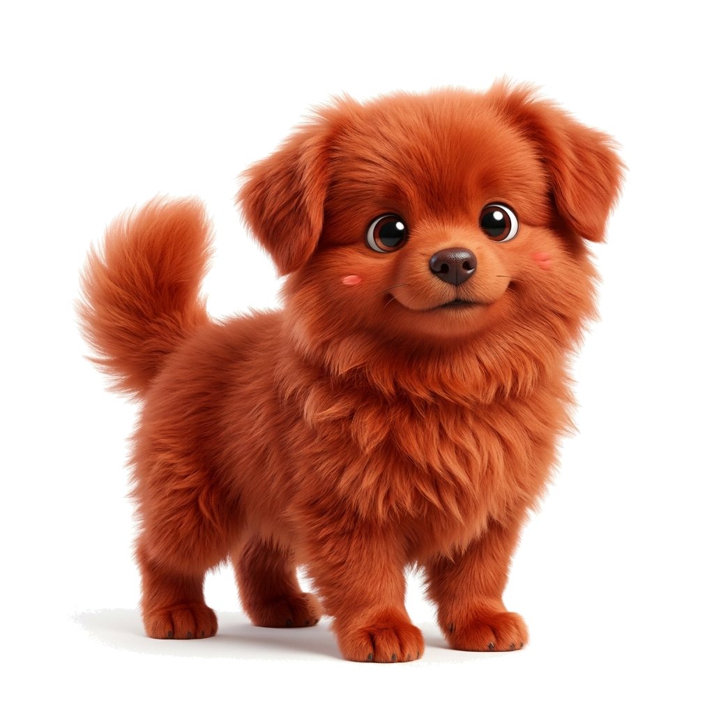
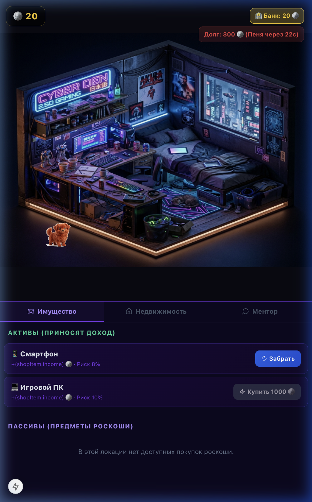
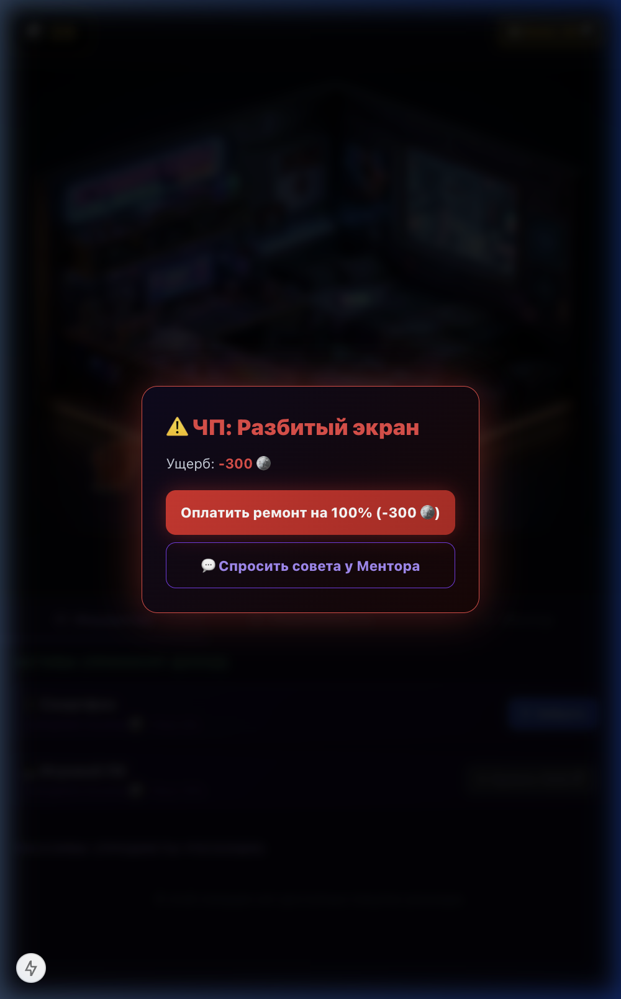
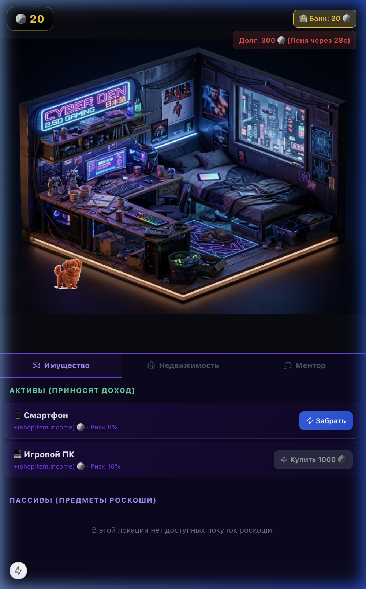
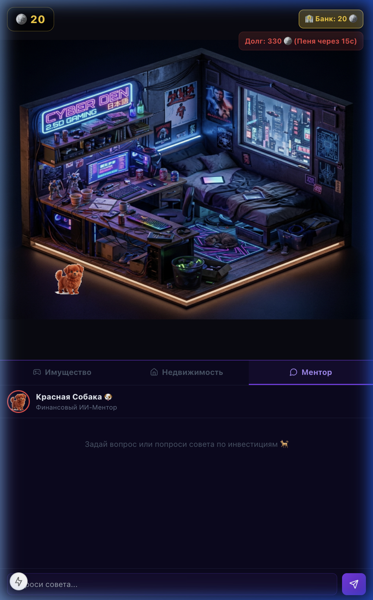

<div align="center">



# CyberSpace & Mentor

**Интерактивный гайд по страхованию для подростков 11-18 лет**

[](https://igs-cyberspace-app-owjc.vercel.app)


</div>

---

<div align="center">



*Изометрическая комната с активами. Каждый предмет приносит доход -- и несёт риск.*

</div>

---

## Демо-видео

<!-- Добавь файл demo.mp4 в корень репо -->
<video src="demo.mp4" controls width="100%" autoplay muted loop></video>

> Если видео не отображается -- [откройте продукт по ссылке](https://igs-cyberspace-app-owjc.vercel.app)

---

## Проблема

Страхование -- одна из самых непонятных финансовых тем для подростков. Термины вроде *франшиза*, *страховая премия*, *полис* звучат как другой язык. Страховые компании традиционно общаются через родителей -- или не общаются вообще.

**Результат:** целое поколение впервые сталкивается с этими понятиями уже во взрослой жизни -- часто в стрессовой ситуации, когда разбираться поздно.

## Решение

**CyberSpace & Mentor** -- не лекция и не видео. Это **опыт**: подросток зарабатывает, покупает вещи, сталкивается с рисками -- и на практике видит, как страховка экономит деньги. Или не экономит, если он её не купил.

| Игровое действие | Реальный финансовый урок |
|---|---|
| Купить страховку на смартфон за 50 монет | Зачем нужна имущественная страховка |
| ЧП: разбитый экран, заплатить 20% вместо 100% | Как работает франшиза (твоя часть оплаты) |
| Скам на скины CS:GO -- страховка не сработала | Мошенничество **не покрывается** страховкой |
| Взять кредит 1000, получить долг 1150 | Комиссии и проценты за использование кредита |
| Не погасить кредит вовремя | Пени: долг растёт каждые 15 секунд |
| YouTube-канал приносит монеты каждую секунду | Что такое пассивный доход |

---

## Пользовательский сценарий

```
  ОНБОРДИНГ               ПОШАГОВОЕ ОБУЧЕНИЕ              СВОБОДНАЯ ИГРА               ПОБЕДА
      |                          |                              |                         |
 Два пути:              Tutorial: 8 шагов                  Покупай предметы          Все 3 локации
 "Начать обучение"       с собакой-ментором                 в 3 локациях            разблокированы
 "Свободная игра"              |                            Страхуй активы          + tutorial пройден
      |                  Заработай монеты                    Управляй рисками        + квиз сдан
 Получаешь              Купи страховку                      Зарабатывай                  |
 смартфон                Столкнись с ЧП                     Погашай долги             Экран
 бесплатно              Увидь разницу                            |                   победы
                               |                           Банк, кредиты,
                         Квиз: 5 вопросов                  пассивный доход
                         с пояснениями
```

---

## Скриншоты

<table>
<tr>
<td width="50%">

### Онбординг

*Два пути: пошаговое обучение или свободная игра*

</td>
<td width="50%">

### Игровой мир

*Изометрическая комната. Предметы появляются при покупке*

</td>
</tr>
<tr>
<td width="50%">

### Активы и страховки

*Работай, страхуй, следи за рисками*

</td>
<td width="50%">

### AI-Ментор

*Claude Sonnet 4.6 отвечает на вопросы о страховании*

</td>
</tr>
</table>

<div align="center">

### Недвижимость -- три локации для разблокировки


</div>

---

## Ключевые фичи

### Пошаговый tutorial (8 шагов)
Собака-ментор ведёт за руку: заработай -> застрахуй -> столкнись с ЧП -> увидь разницу. Подсветка нужного таба, автопереход на информационных шагах, форсированный инцидент для демонстрации. Кнопка "Пропустить" для опытных.

### Квиз проверки знаний (5 вопросов)
Появляется автоматически после tutorial. Темы: франшиза, выгода страховки, нестрахуемые случаи, расчёт риска. Каждый ответ с пояснением. Результат сохраняется.

### AI-Ментор (Claude Sonnet 4.6)
Встроенная база знаний: ОСАГО, КАСКО, ОМС, ДМС, информация об Ингосстрахе. Off-topic фильтр. Fallback-ответы при недоступности API. Понимает игровой контекст (ЧП, скам, поломки).

### Система страхования
Одноразовая страховка с франшизой 20%. При ЧП -- три кнопки: страховая выплата / оплата из кармана / спросить ментора. Предупреждение при нехватке монет (разница уходит в долг). Нестрахуемые случаи (скам) учат границам страхования.

### Цель и победа
Разблокируй все 3 локации + пройди tutorial + сдай квиз = экран победы + кнопка "Начать заново" (удобно для жюри).

---

## Игровые данные

### Активы

| Актив | Стоимость | Страховка | Доход | Риск | Локация |
|---|---|---|---|---|---|
| Смартфон | Бесплатно | 50 | +20/клик | 8% | Комната |
| Игровой ПК | 1 000 | 150 | +100/клик | 10% | Комната |
| Планшет | 3 000 | 300 | +200/клик | 8% | Квартира |
| YouTube-канал | 5 000 | 500 | +20/сек (авто) | 5% | Квартира |
| Электросамокат | 8 000 | 800 | +500/клик | 12% | Дом |

### Инциденты (8 типов)

| Событие | Ущерб | Страхуемый | Привязка |
|---|---|---|---|
| Разбитый экран | 300 | Да | Смартфон |
| Уронил в воду | 500 | Да | Смартфон |
| Украли в метро | 1 000 | Да | Смартфон |
| Вирус-шифровальщик | 800 | Да | ПК |
| Сгорел блок питания | 1 500 | Да | ПК |
| **Скам на скины CS:GO** | **2 500** | **Нет** | ПК |
| Затопили соседи | 2 500 | Да | Квартира |
| Авария на самокате | 4 000 | Да | Самокат |

### Локации

| Локация | Стоимость | Доступные активы |
|---|---|---|
| Стартовая комната | Бесплатно | Смартфон, Игровой ПК |
| Квартира | 5 000 | Планшет, YouTube-канал |
| Частный дом | 12 000 | Электросамокат |

### Банковская система

| Параметр | Значение |
|---|---|
| Кредитный лимит | 5 000 (с учётом 15% комиссии при проверке) |
| Комиссия при займе | +15% к сумме долга сразу |
| Первый дедлайн | 60 секунд после взятия кредита |
| Пеня при просрочке | +5% к долгу, дедлайн обновляется каждые 15 секунд |

---

## Бизнес-логика

### Целевая аудитория

**Заказчик (B2B):** страховая компания (Ингосстрах или любая другая).
**Пользователь:** подростки 11-18 лет, которые только начинают сталкиваться с финансами.

### Почему это работает

Подростки не купят полис сегодня. Но бренд, который **первым объяснил** страхование понятным языком, формирует **Brand Consideration** -- предпочтение, которое конвертируется в клиента через 3-5 лет с минимальным CAC.

```
  СЕГОДНЯ                              ЧЕРЕЗ 3-5 ЛЕТ
     |                                      |
  Подросток играет                    Молодой взрослый
  в CyberSpace                        выбирает страховку
     |                                      |
  Понимает: франшиза,                 Выбирает бренд,
  ОСАГО, риск, скам                    который знает
     |                                      |
  Brand Consideration                 Конверсия в клиента
  формируется                          с минимальным CAC
```

### Модель монетизации

| Канал | Описание |
|---|---|
| **White-label** | Брендированная версия для сайта/приложения страховой компании |
| **Образование** | Интеграция в школьные курсы финансовой грамотности (ФГ) |
| **Lead generation** | После сценария -- предложение реального продукта (страховка гаджета) |

### Метрики пилота

| Метрика | Что измеряет | Реализация в продукте |
|---|---|---|
| **Scenario Completion Rate** | Дошёл ли до конца tutorial | `tutorialCompleted` в Zustand store |
| **Knowledge Lift** | Рост понимания | Квиз 5 вопросов, `quizScore` сохраняется |
| **Insurance Action Rate** | Купил/использовал страховку | Трекинг через `isInsured` / `wasInsured` |
| **Useful Session Rate** | Полезна ли сессия | Composite: tutorial + quiz + продолжение |
| **Brand Consideration Lift** | Отношение к страхованию | Post-survey (следующий этап) |

---

## Технический стек

| Слой | Технология | Обоснование |
|---|---|---|
| **Framework** | Next.js 15.5, React 19, TypeScript | SSR, App Router, быстрый деплой на Vercel |
| **Game Engine** | Phaser 3.85 | Изометрическая 2D-комната, WebGL, анимации, частицы |
| **State** | Zustand 5 + persist middleware | Реактивное состояние + автосохранение в localStorage |
| **AI** | Claude Sonnet 4.6 (Anthropic SDK) | Минимум галлюцинаций среди доступных моделей |
| **UI** | Tailwind CSS + Shadcn/ui + Radix | Тёмная тема, accessible-компоненты |
| **Deploy** | Vercel | Автодеплой из GitHub, serverless API routes |

### Архитектура

```
                        [Vercel CDN + Serverless]
                              |
                    [Next.js 15 App Router]
                         /          \
               [page.tsx]          [/api/chat]
            React UI + Phaser     Claude Sonnet 4.6
                  |                     |
           [Zustand Store]       [Knowledge Base]
            persist ->            ОСАГО, КАСКО, ОМС
            localStorage          Guardrails + Fallback
                  |
          [Phaser 3 Canvas]
           Изометрия, VFX
```

### Структура проекта

```
src/
├── app/
│   ├── page.tsx                  # UI: табы, tutorial overlay, квиз, модалки
│   ├── layout.tsx                # Root layout, viewport meta, шрифты
│   ├── globals.css               # Tailwind + анимации (pulse, fadeIn)
│   └── api/chat/route.ts         # AI Mentor: Claude + guardrails + fallback + rate limit
├── game/
│   └── MainScene.ts              # Phaser 3: рендеринг, анимации, частицы
├── store/
│   └── useGameStore.ts           # Zustand: game state + tutorial + quiz + win condition
├── constants/
│   ├── gameData.ts               # Данные: 5 активов, 3 локации, 8 инцидентов, 8 декоров
│   ├── tutorialSteps.ts          # 8 шагов обучения
│   └── quizData.ts               # 5 вопросов квиза с пояснениями
├── components/
│   ├── PhaserGame.tsx             # Dynamic import Phaser (ssr: false)
│   └── ui/                        # Shadcn: Dialog, Tabs, Avatar, ScrollArea, Card, Button
└── lib/
    ├── supabase.ts                # Подготовлено для синхронизации (этап 2)
    └── utils.ts                   # Утилиты (cn)
```

### Защита от галлюцинаций LLM

| # | Механизм | Что делает |
|---|---|---|
| 1 | **Встроенная база знаний** | Факты о страховании РФ (ОСАГО, КАСКО, ОМС, ДМС, Ингосстрах) в system prompt |
| 2 | **Off-topic фильтр** | Вопросы не про финансы отклоняются без вызова API |
| 3 | **Fallback-словарь** | 11 проверенных ответов на ключевые темы при недоступности API |
| 4 | **Temperature 0.3** | Минимальная вариативность, maxTokens 300 |
| 5 | **Rate limiting** | 15 запросов/мин на IP |

---

## Запуск

### Онлайн

**[igs-cyberspace-app-owjc.vercel.app](https://igs-cyberspace-app-owjc.vercel.app)**

### Локально

```bash
git clone https://github.com/shevchenko9liza/igs-cyberspace-app.git
cd igs-cyberspace-app
npm install --legacy-peer-deps
```

`.env.local`:
```env
ANTHROPIC_API_KEY=your_key_here
```

```bash
npm run dev
# -> http://localhost:3000
```

---

## Roadmap

- [x] Пошаговый tutorial (8 шагов с собакой-ментором)
- [x] Квиз проверки знаний (5 вопросов с пояснениями)
- [x] AI-ментор на Claude Sonnet 4.6 с 5 уровнями guardrails
- [x] Система страхования с франшизой 20%
- [x] Банк: кредиты, комиссия 15%, пени 5%
- [x] Цель игры + экран победы + кнопка сброса
- [x] Деплой на Vercel с рабочей ссылкой
- [ ] Supabase -- синхронизация прогресса между устройствами
- [ ] Новые сценарии: путешествия, спорт, отмена мероприятий
- [ ] Leaderboard -- рейтинг финансовой грамотности
- [ ] Мультиплеер

---

<div align="center">

**Разработано в рамках хакатона Ингосстрах**

*CyberSpace & Mentor -- потому что страхование проще, чем кажется.*

</div>
